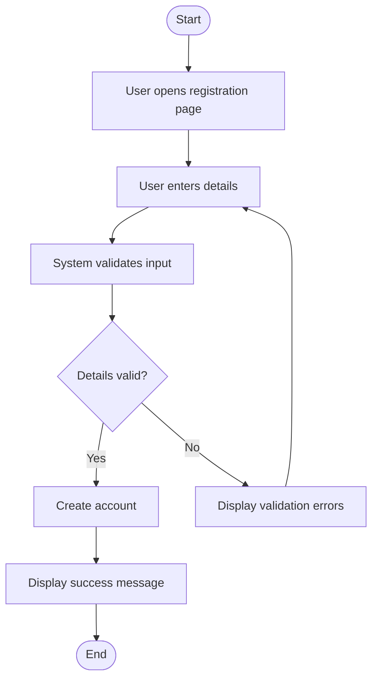
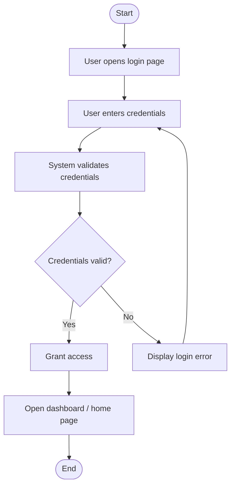
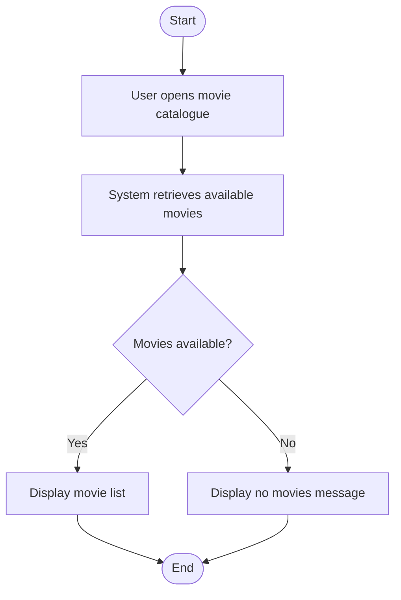
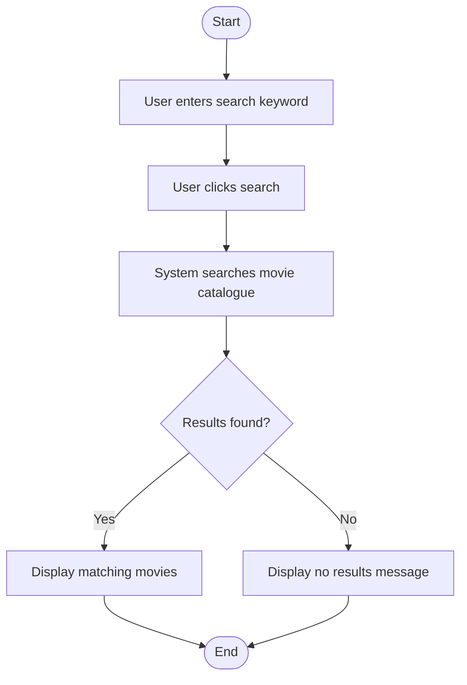
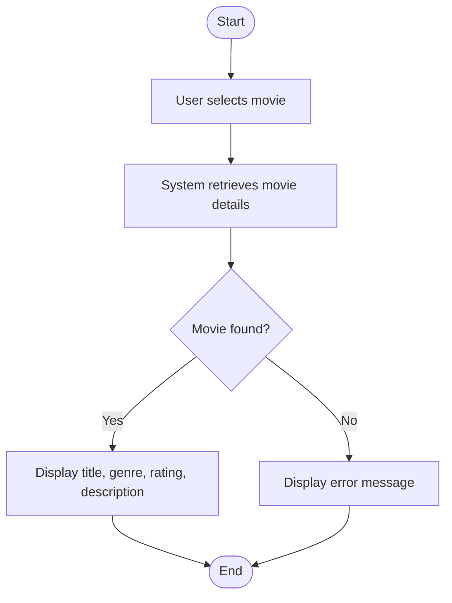
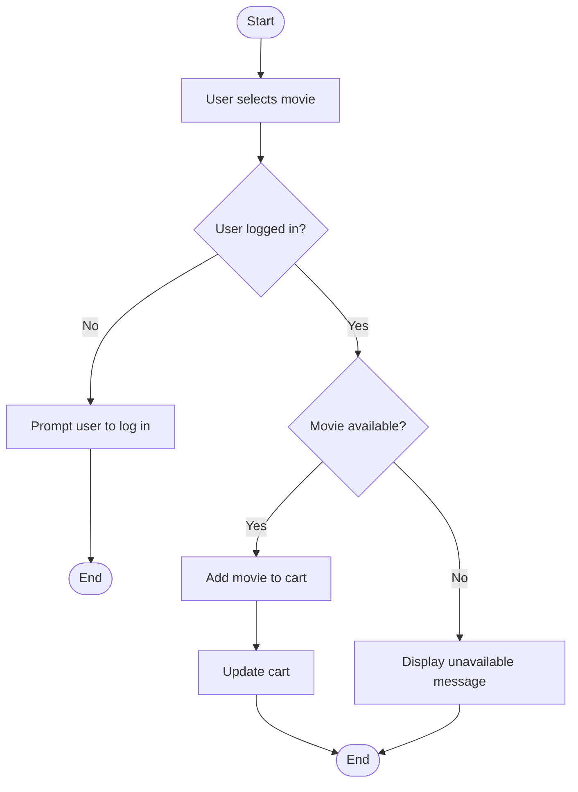
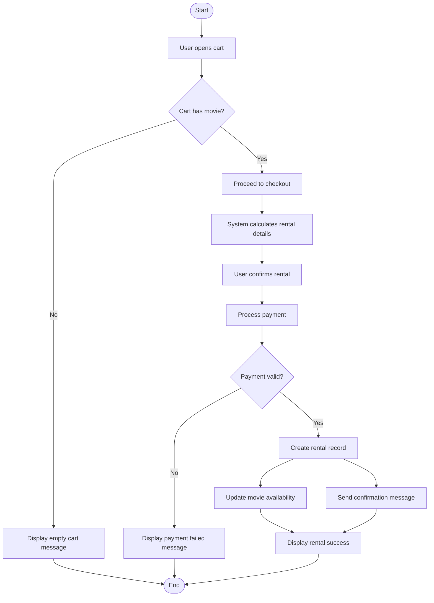
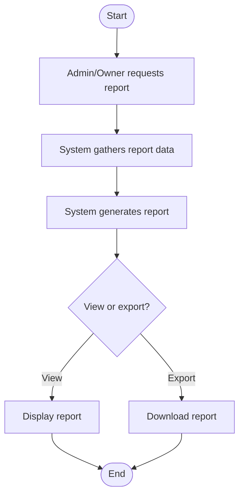

# 🎬 Activity Diagrams  
## Aura Reels Movie Rental System

This section models the main workflows of the Aura Reels Movie Rental System using activity diagrams. These diagrams show how users, administrators, and the system interact to complete key processes.

---

# 👤 User Access Workflows

## 1. User Registration

---

## 2. User Login

---

# 🎥 Movie Discovery Workflows

## 3. Browse Movies

---

## 4. Search Movies

---

## 5. View Movie Details

---

# 🛒 Rental Workflows

## 6. Add Movie to Cart

---

## 7. Rent Movie

---

# 📊 Administrative Workflow

## 8. Generate Report

---
