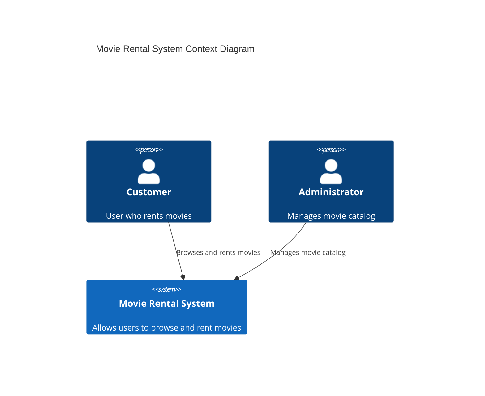
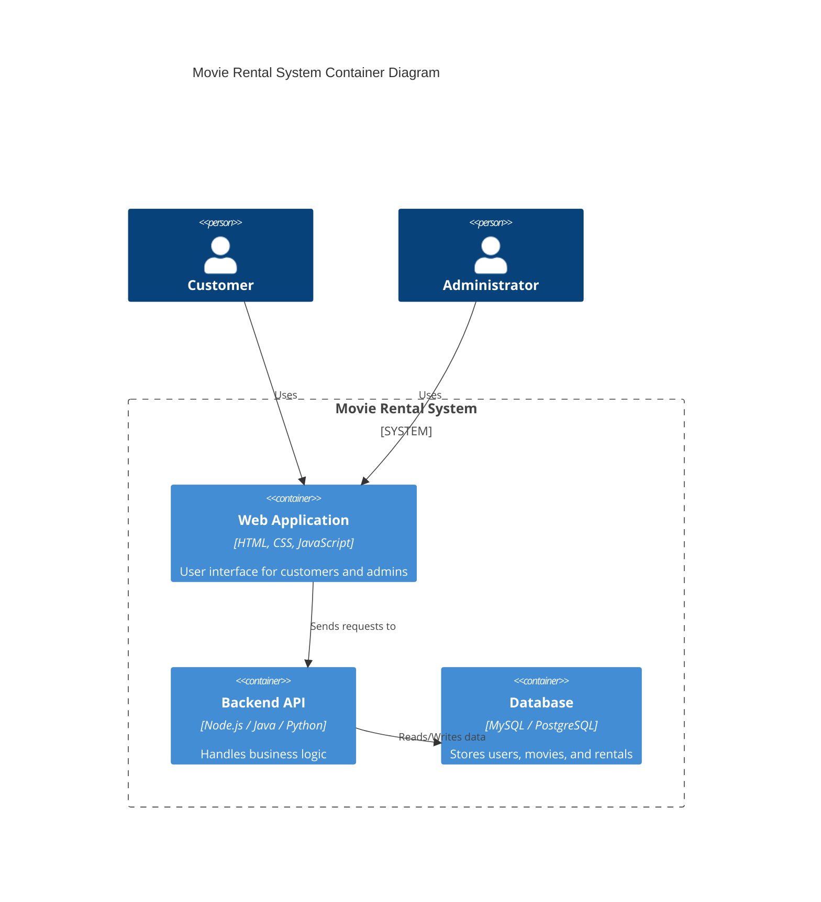

# Movie Rental System Architecture

## Project Title

Movie Rental System

## Domain

Entertainment / Movie Rental Services

## Problem Statement

The system provides an online platform where users can browse and rent movies digitally instead of visiting physical rental stores.

## Individual Scope

The system will allow users to register, browse movies, rent movies, and manage their rentals while administrators manage the movie catalog.

---

# C4 System Architecture

## Level 1: System Context Diagram

This diagram shows how users interact with the Movie Rental System.



---

## Level 2: Container Diagram

This diagram shows the main system containers.



---

## Level 3: Component Diagram

This diagram shows internal backend components.

```mermaid
C4Component
title Movie Rental System Component Diagram

Container(api, "Backend API") {

Component(userService, "User Service", "Handles user accounts")

Component(movieService, "Movie Service", "Manages movie catalog")

Component(rentalService, "Rental Service", "Processes movie rentals")

Component(databaseAccess, "Database Access", "Handles database operations")

}

Rel(userService, databaseAccess, "Reads/Writes")

Rel(movieService, databaseAccess, "Reads/Writes")

Rel(rentalService, databaseAccess, "Reads/Writes")
```
