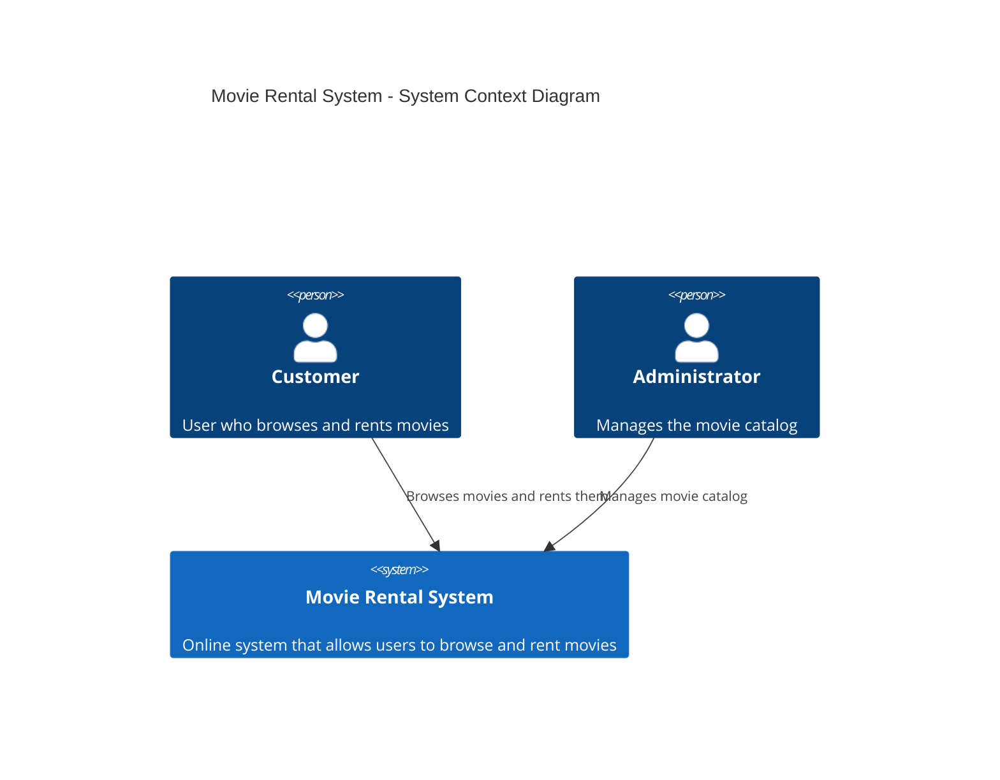
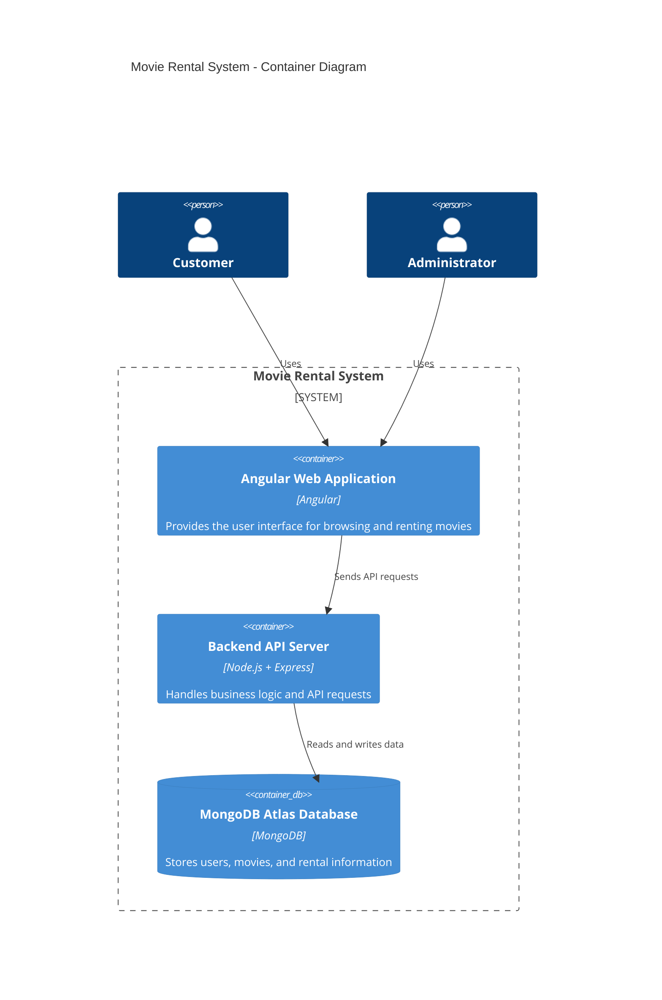

# Movie Rental System Architecture

## Project Title

Movie Rental System

---

# Domain

The system belongs to the **Entertainment and Movie Rental domain**.
It provides an online platform where users can browse and rent movies digitally through a web application.

---

# Problem Statement

Traditional movie rental stores require customers to physically visit a store to rent movies. This is inconvenient for users who prefer online access to entertainment services.

The Movie Rental System provides an online platform that allows users to browse available movies, rent them digitally, and manage their rentals from anywhere using a web application.

---

# Individual Scope

This system will be developed as an individual project and will include the following core functionality:

* User registration and login
* Browsing available movies
* Searching movies
* Renting movies
* Viewing rental history
* Administrator management of movie catalog

---

# C4 Model Architecture

The system architecture is described using the **C4 Model**, which explains the system at different levels.

The diagrams included are:

1. System Context Diagram
2. Container Diagram
3. Component Diagram

---

# Level 1 — System Context Diagram

This diagram shows how external users interact with the Movie Rental System.



### Explanation

The Movie Rental System interacts with two main users:

**Customer**

* Registers and logs into the system
* Browses available movies
* Searches movies
* Rents movies

**Administrator**

* Adds movies
* Updates movie information
* Removes movies from the system

---

# Level 2 — Container Diagram

This diagram shows the main containers that make up the system.



### Explanation

The system contains three main containers:

**Angular Web Application**

* Built using Angular
* Provides the frontend interface
* Allows users to interact with the system

**Backend API Server**

* Built using Node.js and Express
* Processes requests from the frontend
* Handles authentication, movie browsing, and rentals

**Database**

* MongoDB database hosted on MongoDB Atlas
* Stores system data such as users, movies, and rentals

---

# Level 3 — Component Diagram

This diagram shows the main components inside the backend API.

```mermaid
C4Component
title Movie Rental System - Backend Component Diagram

Container(apiServer, "Backend API Server", "Node.js + Express") {

Component(authController, "Authentication Controller", "Handles user registration and login")

Component(movieController, "Movie Controller", "Handles movie catalog operations")

Component(rentalController, "Rental Controller", "Handles movie rental operations")

Component(databaseService, "Database Service", "Handles communication with MongoDB")

}

Rel(authController, databaseService, "Stores and retrieves user data")

Rel(movieController, databaseService, "Stores and retrieves movie data")

Rel(rentalController, databaseService, "Stores and retrieves rental data")
```

### Explanation

The backend API consists of several components:

**Authentication Controller**

* Handles login and registration
* Manages user authentication

**Movie Controller**

* Retrieves movie data
* Allows administrators to manage the movie catalog

**Rental Controller**

* Processes movie rental requests
* Records rental transactions

**Database Service**

* Connects to MongoDB
* Stores and retrieves system data

---

# End-to-End System Flow

The Movie Rental System works as follows:

1. A user opens the Angular web application.
2. The user registers or logs into the system.
3. The user browses or searches for movies.
4. The user selects a movie to rent.
5. The Angular frontend sends an API request to the backend server.
6. The backend server processes the request.
7. Rental information is stored in MongoDB Atlas.
8. The system confirms the rental to the user.

