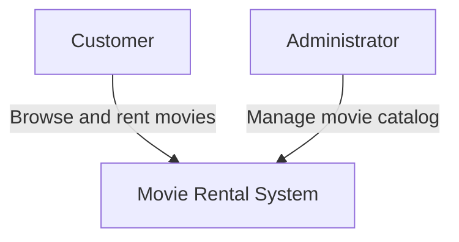
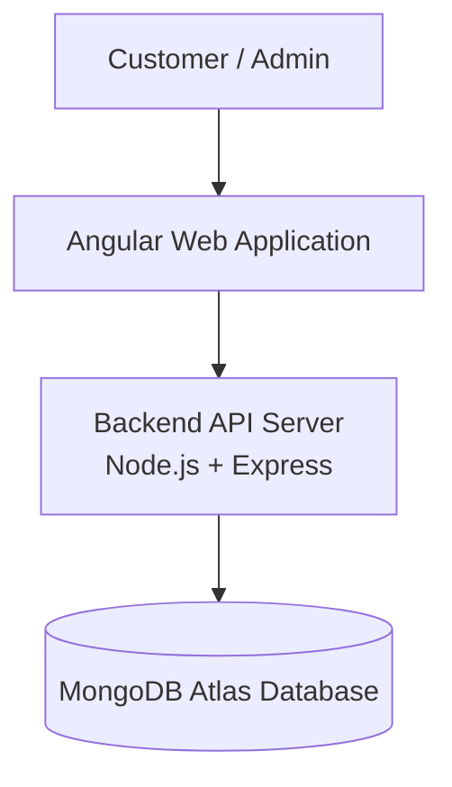
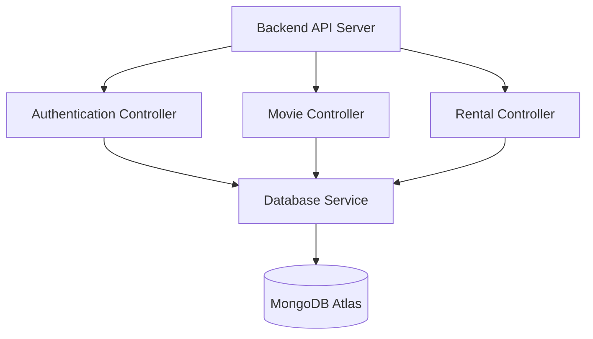

# Movie Rental System Architecture

## Project Title

Movie Rental System

---

# Domain

The Movie Rental System belongs to the **Entertainment and Media domain**.
It provides a digital platform where users can browse and rent movies online instead of visiting a physical rental store.

---

# Problem Statement

Traditional movie rental stores require customers to travel to a physical location to rent movies. This can be inconvenient and time consuming for users.

The Movie Rental System provides an online platform where users can browse available movies, rent them digitally, and manage their rental history from anywhere using a web application.

---

# Individual Scope

This project will be developed as an individual system focusing on the core features of an online movie rental platform.

The system will include:

### User Features

* User registration
* User login and authentication
* Browse available movies
* Search for movies
* Rent movies
* View rental history

### Administrator Features

* Add new movies
* Update movie information
* Remove movies
* Manage movie availability

---

# C4 Model Architecture

The system architecture is described using a simplified version of the **C4 Model**.
The diagrams included are:

1. System Context Diagram
2. Container Diagram
3. Component Diagram

---

# Level 1 — System Context Diagram

This diagram shows how external users interact with the Movie Rental System.

### Explanation

The system interacts with two main users:

**Customer**

* Registers and logs into the system
* Browses available movies
* Searches movies
* Rents movies

**Administrator**

* Adds movies
* Updates movie information
* Removes movies
* Manages movie availability

---

# Level 2 — Container Diagram

This diagram shows the main containers that make up the system.

### Explanation

The system consists of three main containers:

**Angular Web Application**

* Built using Angular
* Provides the user interface for browsing and renting movies

**Backend API Server**

* Built using Node.js and Express
* Handles business logic and processes requests from the frontend

**Database**

* Uses MongoDB
* Hosted on MongoDB Atlas cloud database

---

# Level 3 — Component Diagram

This diagram shows the internal components inside the backend API.

### Explanation

The backend API consists of several components:

**Authentication Controller**

* Handles user registration
* Handles login authentication

**Movie Controller**

* Retrieves movie information
* Allows administrators to manage movie catalog

**Rental Controller**

* Processes movie rental requests
* Stores rental records

**Database Service**

* Communicates with MongoDB database
* Handles storing and retrieving system data

---

# End-to-End System Flow

The Movie Rental System works as follows:

1. The user opens the Angular web application.
2. The user registers or logs into the system.
3. The user browses or searches for movies.
4. The user selects a movie to rent.
5. The Angular frontend sends an API request to the backend server.
6. The backend server processes the request.
7. Rental information is stored in MongoDB Atlas.
8. The system confirms the rental to the user.

