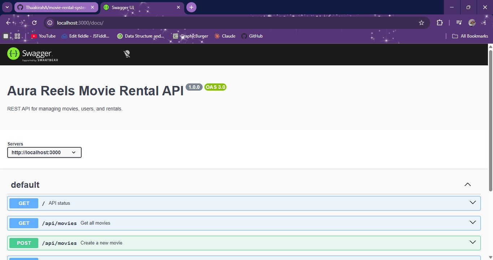
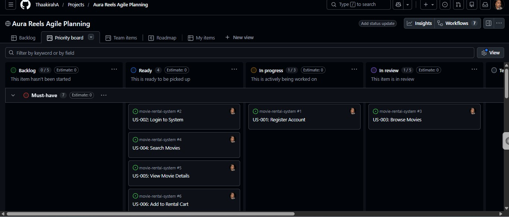
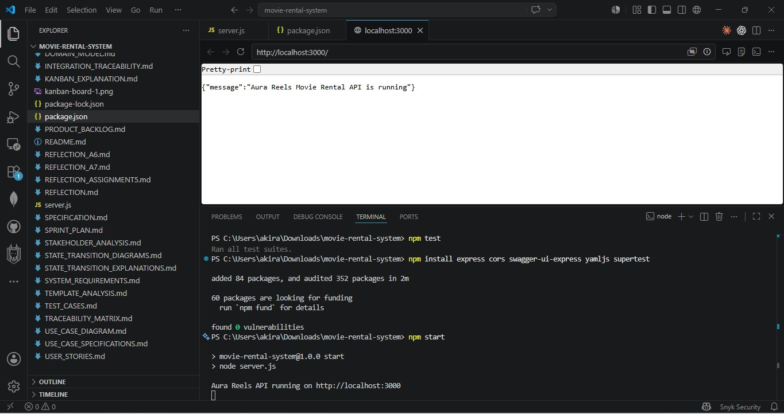

# 📸 Assignment 12 Screenshots – Aura Reels Movie Rental System

---

## 1. Swagger/OpenAPI Documentation

This screenshot demonstrates the Swagger UI documentation for the Aura Reels Movie Rental REST API.

It shows:

* Available API endpoints
* Request and response structures
* Interactive API testing interface
* OpenAPI integration using Swagger UI

### Screenshot

---

## 2. GitHub Project Board

This screenshot demonstrates the GitHub Project Board used to manage Assignment 12 development tasks.

It shows:

* Workflow columns
* Completed tasks
* Linked issues
* Agile/Kanban workflow tracking

### Screenshot

---

## 3. API Testing

This screenshot demonstrates successful API testing using automated integration tests.

It shows:

* Passing Jest tests
* API endpoint validation
* Service layer and REST API integration

### Screenshot

---

## 📘 Summary

The screenshots above provide evidence of:

* REST API implementation
* Swagger/OpenAPI documentation
* GitHub project management workflow
* Automated API testing
* Successful integration of the service and repository layers

---
