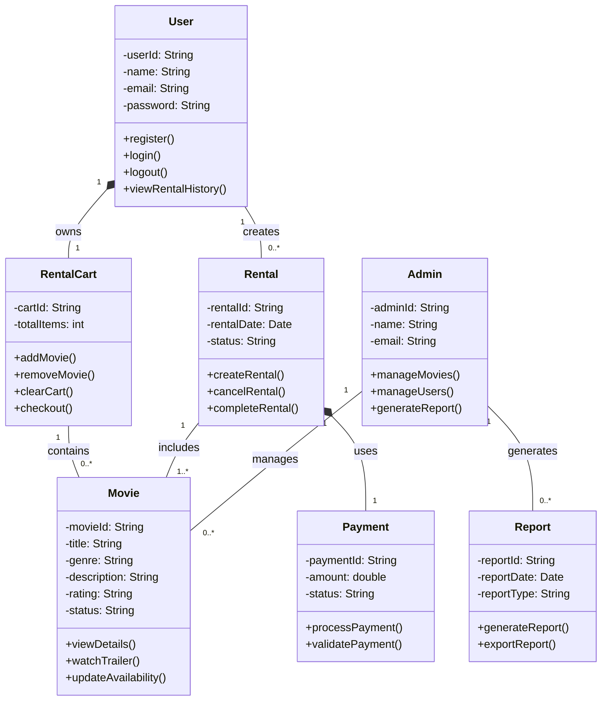

# 🎬 Class Diagram  
## Aura Reels Movie Rental System

This class diagram models the structural design of the Aura Reels Movie Rental System. It includes the main classes, their attributes and methods, and the relationships between them.

---

---

## Key Design Decisions

### 1. Core User and Admin Separation
The system models **User** and **Admin** as separate classes because they perform different responsibilities. Users interact with rentals and carts, while admins manage movies and generate reports.

### 2. Composition Relationships
A **User** owns exactly one **RentalCart**, so composition is used because the cart belongs directly to the user.  
A **Rental** also has one **Payment**, so composition is used there because payment is tightly linked to the rental transaction.

### 3. Associations
A **User** can create multiple **Rentals**, and a **Rental** may include one or more **Movies**.  
A **RentalCart** contains multiple movies before checkout.

### 4. Administrative Control
The **Admin** class is linked to **Movie** and **Report** because administrators manage movie availability and generate reports for monitoring the system.

### 5. Alignment with Prior Assignments
This class diagram aligns with:
- Assignment 4 functional requirements such as registration, login, browsing movies, renting movies, and generating reports
- Assignment 5 use cases such as Register Account, Login, Browse Movies, Add to Rental Cart, Rent Movie, and Generate Reports
- Assignment 8 behavioural models such as the Movie, Rental, Payment, and User Session object lifecycles
