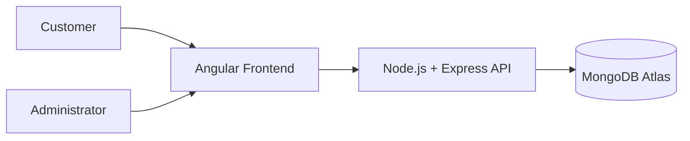

# 🎬 Movie Rental System

---

## 📌 Project Overview

The **Movie Rental System** is a web-based application that allows users to browse, search, and rent movies online.

The system provides a digital alternative to traditional movie rental stores by allowing users to manage their rentals through a simple and intuitive web interface.

The application uses **Angular** for the frontend and **Node.js with Express** for the backend API. Data is stored in **MongoDB** hosted on **MongoDB Atlas**.

> This repository demonstrates the full Software Engineering lifecycle, from system specification and design to Agile planning and testing.

---

## 👥 Users of the System

### Customer

- Register an account
- Login to the system
- Browse available movies
- Search for movies
- Rent movies
- View rental history

### Administrator

- Add new movies
- Update movie details
- Delete movies
- Manage movie availability

---

## ⚙️ Technology Stack

### Frontend

- Angular
- HTML
- CSS
- TypeScript

### Backend

- Node.js
- Express.js
- REST API

### Database

- MongoDB
- MongoDB Atlas

### Version Control

- Git
- GitHub

---

## 🏗 System Architecture

The system architecture consists of three main components.

### System Architecture Diagram

### Architecture Explanation

**Frontend (Angular)**
Provides the user interface where customers browse movies and administrators manage the catalog.

**Backend (Node.js + Express)**
Processes business logic, authentication, and handles API requests between the frontend and the database.

**Database (MongoDB Atlas)**
Stores application data including users, movies, and rental records.

---

## 🔄 System Workflow

1. User opens the web application
2. User registers or logs into the system
3. User browses the movie catalog
4. User searches or selects a movie
5. The system processes the rental request
6. Rental information is stored in the database
7. The system confirms the rental to the user

---

## 📂 Project Structure

    movie-rental-system
    │
    ├── frontend (Angular Application)
    │   ├── components
    │   ├── services
    │   └── models
    │
    ├── backend (Node.js API)
    │   ├── controllers
    │   ├── routes
    │   └── models
    │
    ├── README.md
    ├── SPECIFICATION.md
    ├── ARCHITECTURE.md
    ├── STAKEHOLDER_ANALYSIS.md
    ├── SYSTEM_REQUIREMENTS.md
    ├── REFLECTION.md
    ├── USE_CASE_DIAGRAM.md
    ├── USE_CASE_SPECIFICATIONS.md
    ├── TEST_CASES.md
    ├── REFLECTION_ASSIGNMENT5.md
    ├── USER_STORIES.md
    ├── PRODUCT_BACKLOG.md
    ├── SPRINT_PLAN.md
    ├── REFLECTION_A6.md
    └── images/

---

## 📚 Project Documentation

This project contains documentation created for multiple assignments in the Software Engineering module.

---

### 📘 Assignment 3 Documentation

These documents describe the initial system design and architecture.

- 📄 [System Specification](SPECIFICATION.md)
- 🏗 [System Architecture](ARCHITECTURE.md)

---

### 📗 Assignment 4 Documentation

These documents focus on stakeholder analysis and system requirements.

- 👥 [Stakeholder Analysis](STAKEHOLDER_ANALYSIS.md)
- ⚙️ [System Requirements](SYSTEM_REQUIREMENTS.md)
- 📝 [Reflection](REFLECTION.md)

---

### 📙 Assignment 5 Documentation

These documents focus on use case modelling, use case specifications, and system testing.

- 🎭 [Use Case Diagram](USE_CASE_DIAGRAM.md)
- 📄 [Use Case Specifications](USE_CASE_SPECIFICATIONS.md)
- ✅ [Test Cases](TEST_CASES.md)
- 📝 [Reflection – Assignment 5](REFLECTION_ASSIGNMENT5.md)

---

### 📕 Assignment 6 Documentation

These documents demonstrate the application of Agile methodology, including user story creation, backlog prioritisation, sprint planning, and reflection.

- 🧾 [User Stories](USER_STORIES.md)
- 📊 [Product Backlog](PRODUCT_BACKLOG.md)
- 🚀 [Sprint Plan](SPRINT_PLAN.md)
- 📝 [Reflection – Assignment 6](REFLECTION_A6.md)

---

### 📗 Assignment 7 Documentation

These documents demonstrate the analysis of GitHub project templates, implementation of a customised Kanban board, and reflection on Agile workflow management.

* 📊 [Template Analysis](template_analysis.md)
* 📋 [Kanban Explanation](kanban_explanation.md)
* 📝 [Reflection – Assignment 7](reflection_A7.md)

## 🧩 Kanban Board Implementation

A custom Kanban board was created using the **Team Planning template** in GitHub Projects to manage Agile workflows for the system.

The board was customised by adding additional columns such as **Testing** and **Blocked** to improve workflow visibility and track task progress more effectively.

All user stories from Assignment 6 were linked as GitHub Issues and organised across the board based on their current development status. Tasks were assigned to the developer using @mentions, and labels such as **feature** were used to categorise work items.

The Kanban board provides a clear visual representation of task progress, supports efficient workflow management, and aligns with Agile development practices.

---

## 🚀 Future Improvements

Possible future features include:

- Movie ratings and reviews
- Online payment integration
- Movie recommendation system
- Watch movie trailers
- Mobile application support

---

## 👨‍💻 Author

ThaakirahA

Software Development

Honours Student – Software Engineering

GitHub: https://github.com/ThaakirahA
