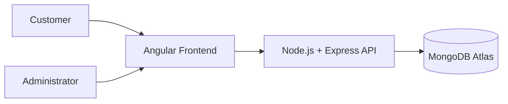

# 🎬 Movie Rental System


---

## 📌 Project Overview

The **Movie Rental System** is a web-based application that allows users to browse, search, and rent movies online.

The system provides a digital alternative to traditional movie rental stores by allowing users to manage their rentals through a simple and intuitive web interface.

The application uses **Angular** for the frontend and **Node.js with Express** for the backend API. Data is stored in **MongoDB** hosted on **MongoDB Atlas**.

---

## 👥 Users of the System

### Customer

* Register an account
* Login to the system
* Browse available movies
* Search for movies
* Rent movies
* View rental history

### Administrator

* Add new movies
* Update movie details
* Delete movies
* Manage movie availability

---

## ⚙️ Technology Stack

### Frontend

* Angular
* HTML
* CSS
* TypeScript

### Backend

* Node.js
* Express.js
* REST API

### Database

* MongoDB
* MongoDB Atlas

### Version Control

* Git
* GitHub

---

## 🏗 System Architecture

The system architecture consists of three main components.

### System Architecture Diagram



### Architecture Explanation

**Frontend (Angular)**
Provides the user interface where customers browse movies and administrators manage the catalog.

**Backend (Node.js + Express)**
Processes business logic, authentication, and handles API requests between the frontend and the database.

**Database (MongoDB Atlas)**
Stores application data including users, movies, and rental records.

---

## 🔄 System Workflow

1. User opens the web application.
2. User registers or logs into the system.
3. User browses the movie catalog.
4. User searches or selects a movie.
5. The system processes the rental request.
6. Rental information is stored in the database.
7. The system confirms the rental to the user.

---

## 📂 Project Structure

```
movie-rental-system
│
├── frontend (Angular Application)
│   ├── components
│   ├── services
│   └── models
│
├── backend (Node.js API)
│   ├── controllers
│   ├── routes
│   └── models
│
├── README.md
├── SPECIFICATION.md
├── ARCHITECTURE.md
├── STAKEHOLDER_ANALYSIS.md
├── SYSTEM_REQUIREMENTS.md
└── REFLECTION.md
```

---

## 📚 Project Documentation

This project contains documentation created for multiple assignments in the Software Engineering module.

---

### 📘 Assignment 3 Documentation

These documents describe the initial system design and architecture.

* 📄 [System Specification](SPECIFICATION.md)
* 🏗 [System Architecture](ARCHITECTURE.md)

---

### 📗 Assignment 4 Documentation

These documents focus on stakeholder analysis and system requirements.

* 👥 [Stakeholder Analysis](STAKEHOLDER_ANALYSIS.md)
* ⚙️ [System Requirements](SYSTEM_REQUIREMENTS.md)
* 📝 [Reflection](REFLECTION.md)

---

## 🚀 Future Improvements

Possible future features include:

* Movie ratings and reviews
* Online payment integration
* Movie recommendation system
* Watch movie trailers
* Mobile application support

---

## 👨‍💻 Author

Thaakirah A

Software Development Student
Honours Student – Software Engineering

GitHub: https://github.com/ThaakirahA
