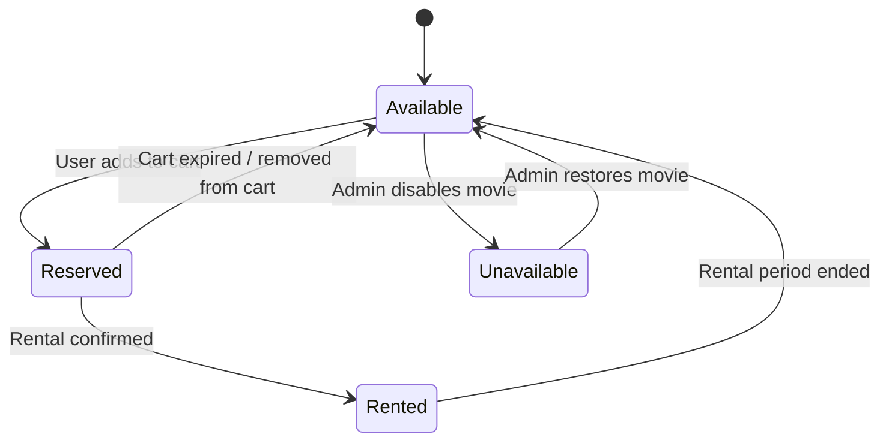
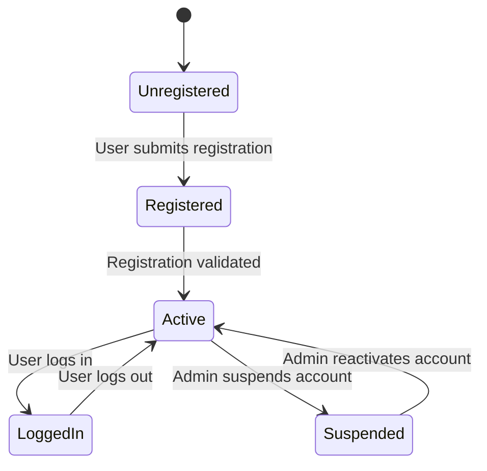
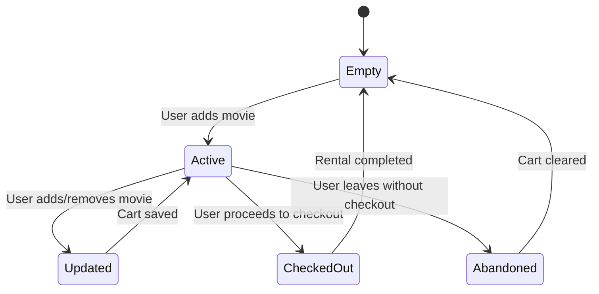
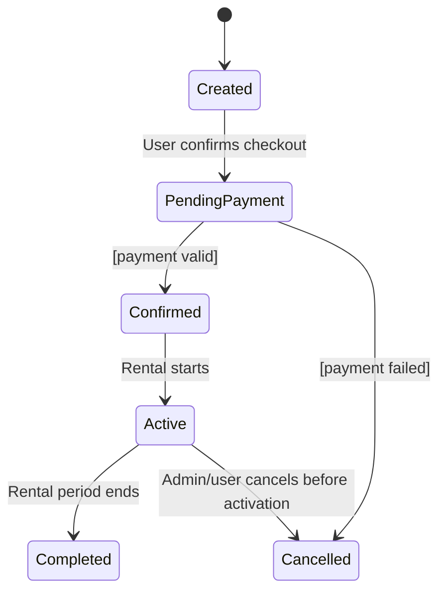
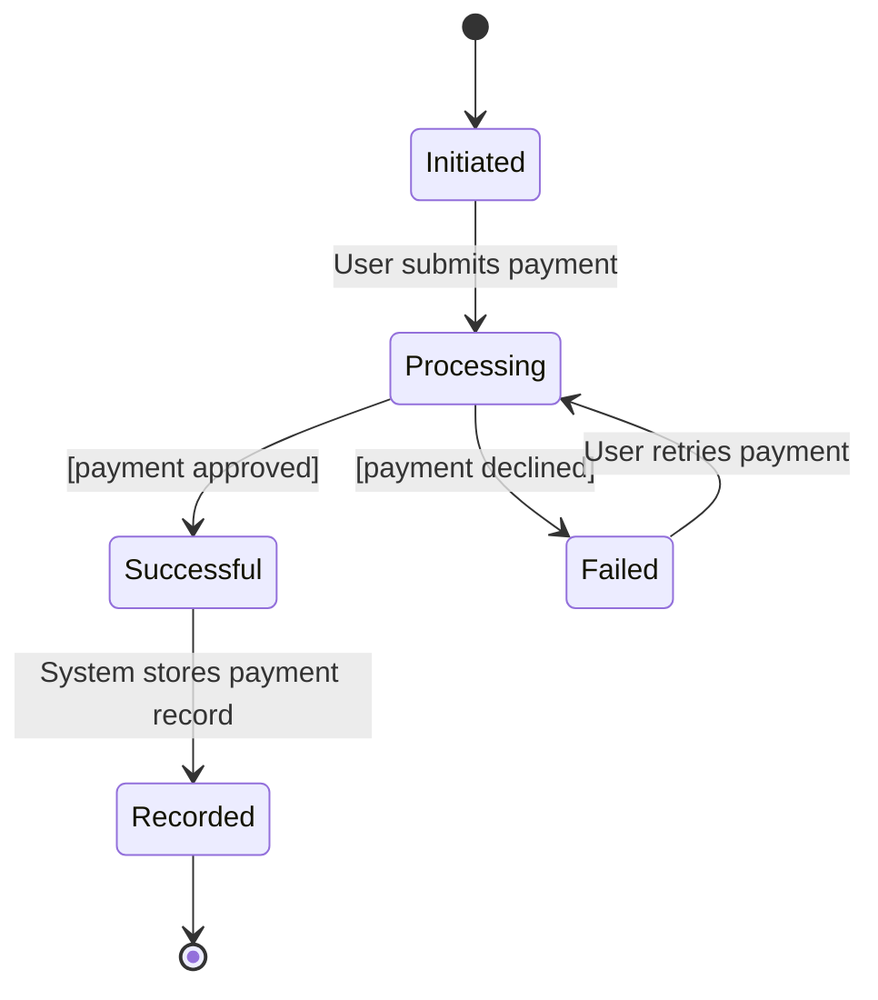
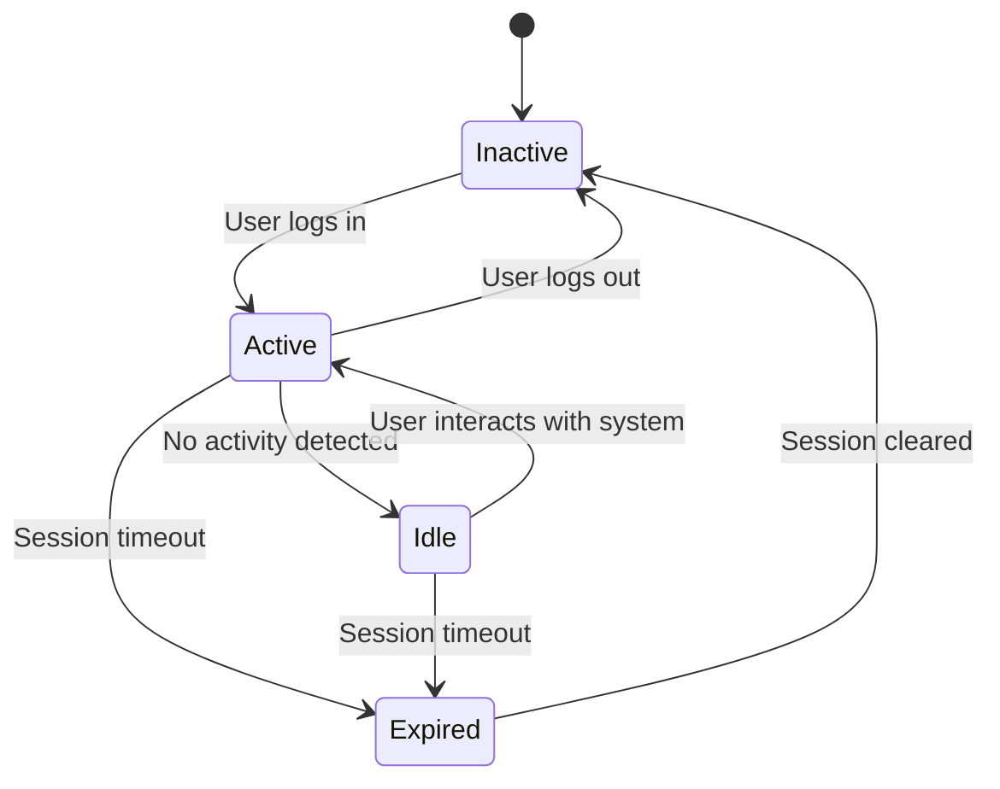
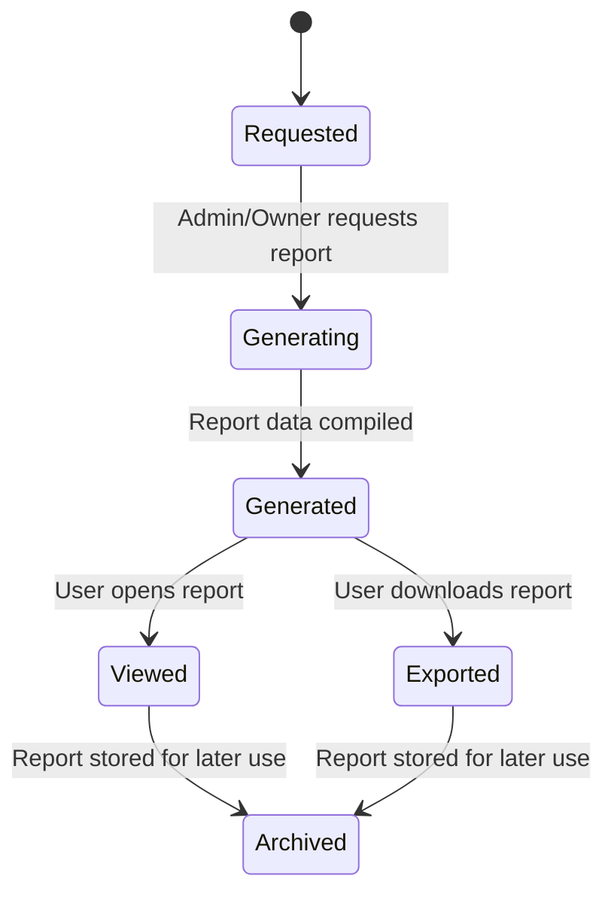
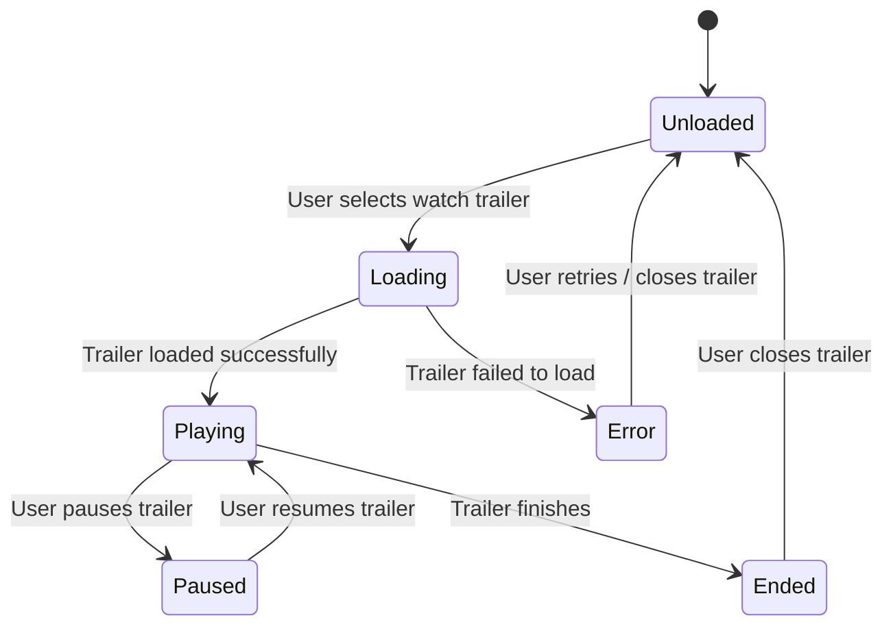

# 🎬 State Transition Diagrams  
## Aura Reels Movie Rental System

This document presents the state transition diagrams for key objects in the Aura Reels Movie Rental System. Each diagram illustrates how objects change states in response to user actions, system events, and administrative operations.

---

## 1. Movie Object

---

## 2. User Account Object

---

## 3. Rental Cart Object

---

## 4. Rental Object

---

## 5. Payment Object

---

## 6. User Session Object

---

## 7. Report Object

---

## 8. Trailer Object

---
