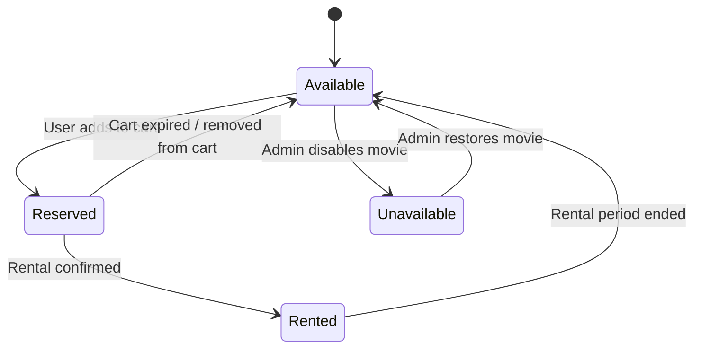
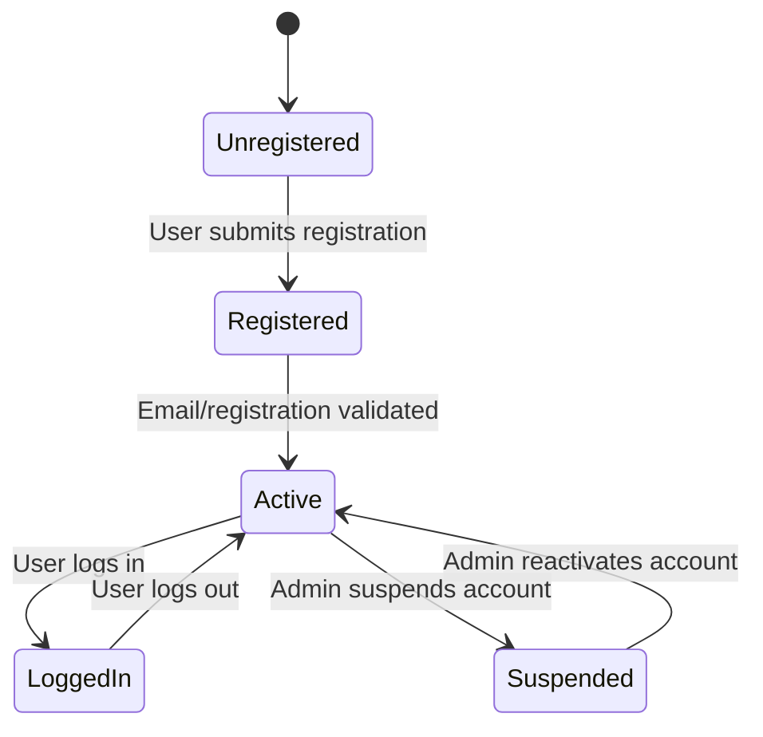
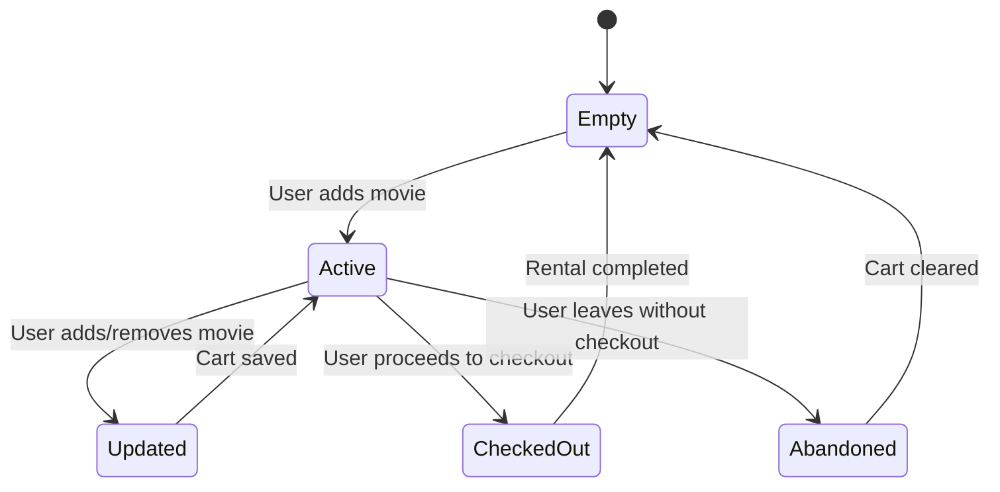
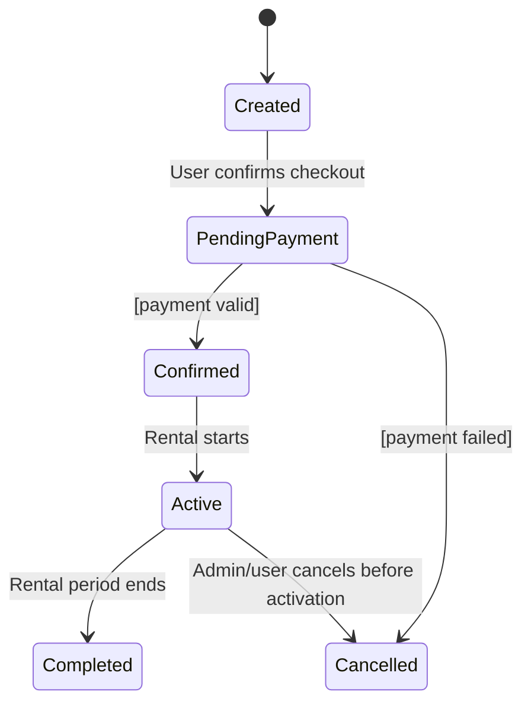

# 🎬 State Transition Diagrams – Aura Reels Movie Rental System

---

## 1. Movie Object


```mermaid
stateDiagram-v2
    [*] --> Available
    Available --> Reserved : User adds to cart
    Reserved --> Available : Cart expired / removed from cart
    Reserved --> Rented : Rental confirmed
    Rented --> Available : Rental period ended
    Available --> Unavailable : Admin disables movie
    Unavailable --> Available : Admin restores movie
```

---

## 2. User Account Object


```mermaid
stateDiagram-v2
    [*] --> Unregistered
    Unregistered --> Registered : User submits registration
    Registered --> Active : Email/registration validated
    Active --> LoggedIn : User logs in
    LoggedIn --> Active : User logs out
    Active --> Suspended : Admin suspends account
    Suspended --> Active : Admin reactivates account
```

---

## 3. Rental Cart Object


```mermaid
stateDiagram-v2
    [*] --> Empty
    Empty --> Active : User adds movie
    Active --> Updated : User adds/removes movie
    Updated --> Active : Cart saved
    Active --> CheckedOut : User proceeds to checkout
    CheckedOut --> Empty : Rental completed
    Active --> Abandoned : User leaves without checkout
    Abandoned --> Empty : Cart cleared
```

---

## 4. Rental Object


```mermaid
stateDiagram-v2
    [*] --> Created
    Created --> PendingPayment : User confirms checkout
    PendingPayment --> Confirmed : [payment valid]
    PendingPayment --> Cancelled : [payment failed]
    Confirmed --> Active : Rental starts
    Active --> Completed : Rental period ends
    Active --> Cancelled : Admin/user cancels before activation
```
```
