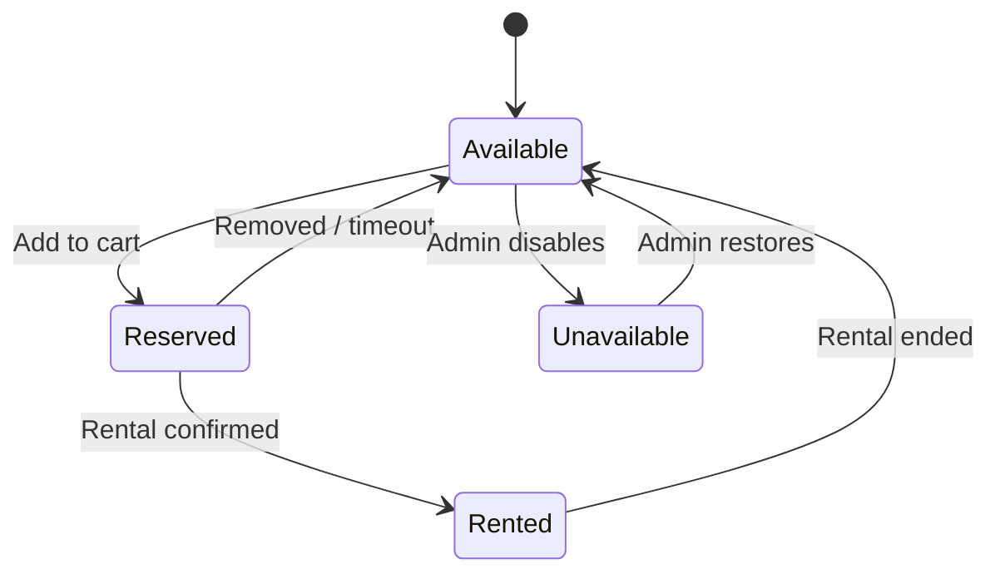
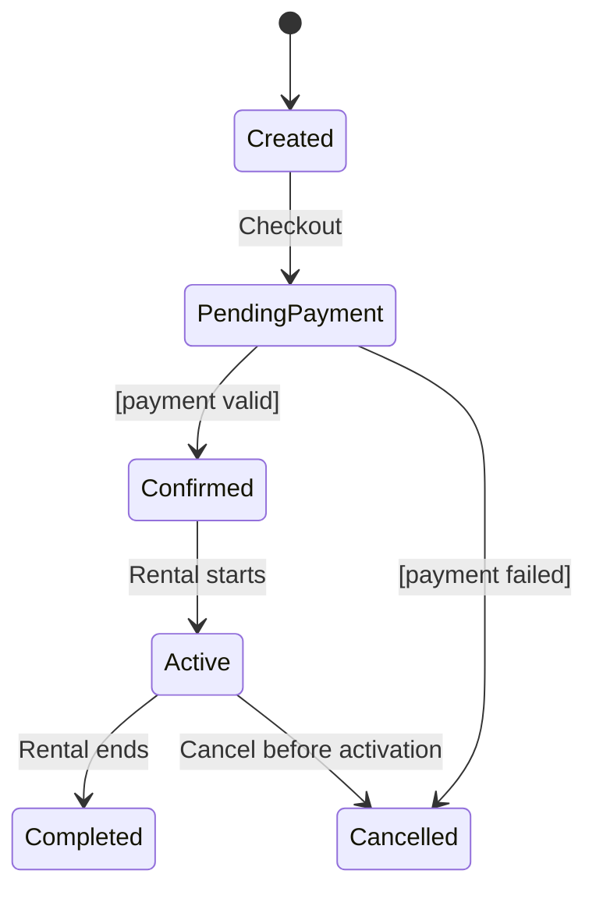
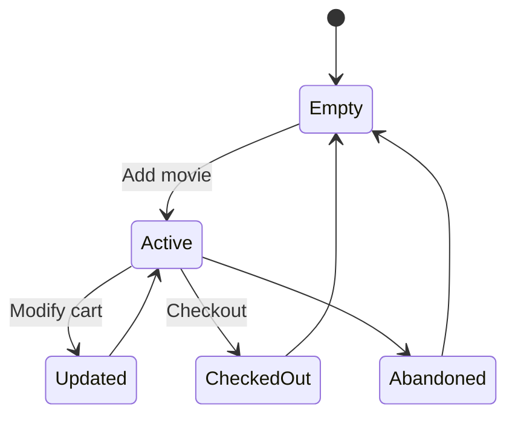
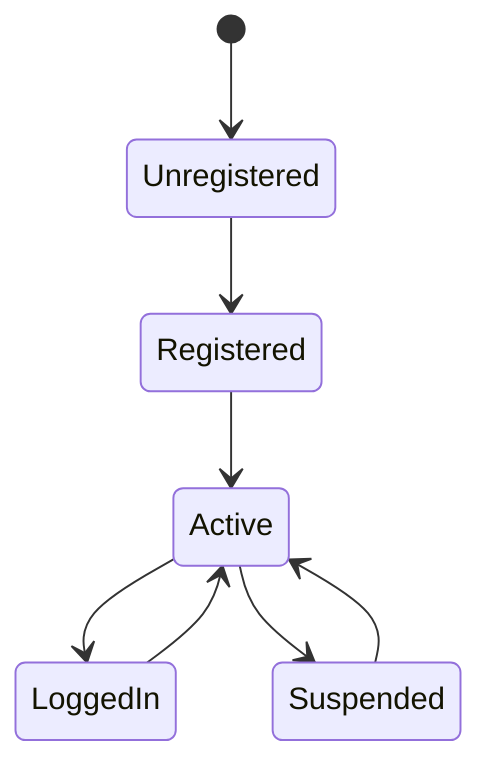
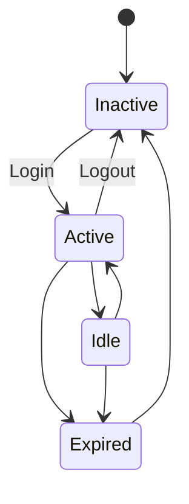
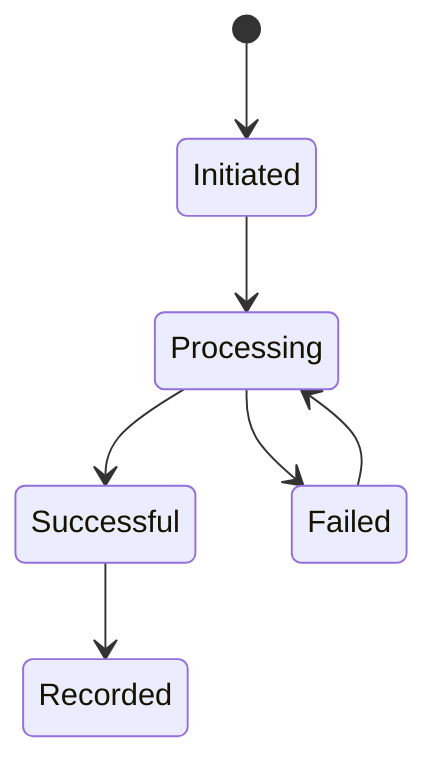
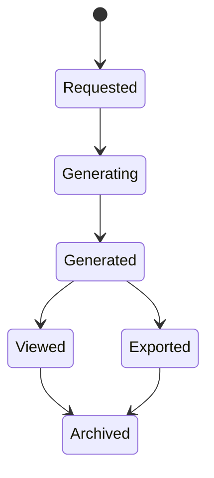
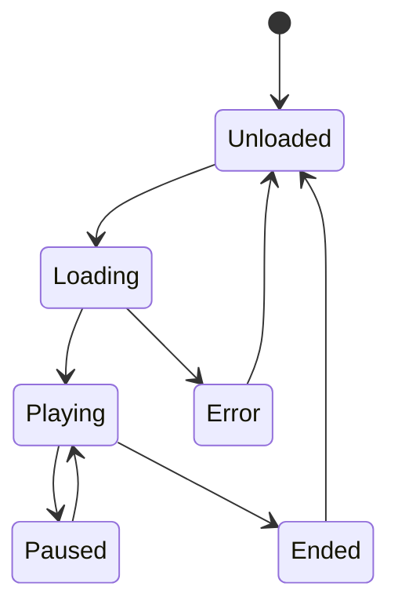

# 🎬 State Transition Diagrams  
## Aura Reels Movie Rental System

This section models how key system objects change state based on user actions, system events, and administrative controls.

---

# 🎥 Core User Interaction Objects

## 1. Movie

---

## 2. Rental

---

## 3. Rental Cart

---

# 👤 User & Session Management

## 4. User Account

---

## 5. User Session

---

# 💳 Transaction & System Processes

## 6. Payment

---

## 7. Report

---

# 🎞 Media Interaction

## 8. Trailer

---
